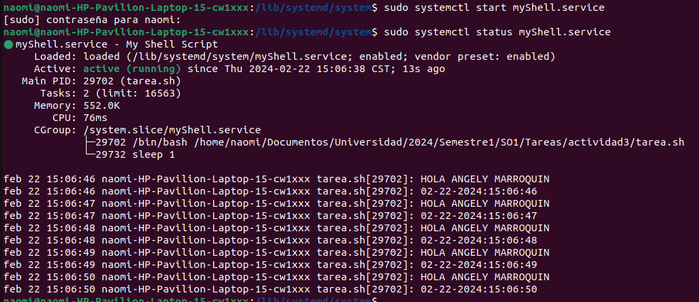
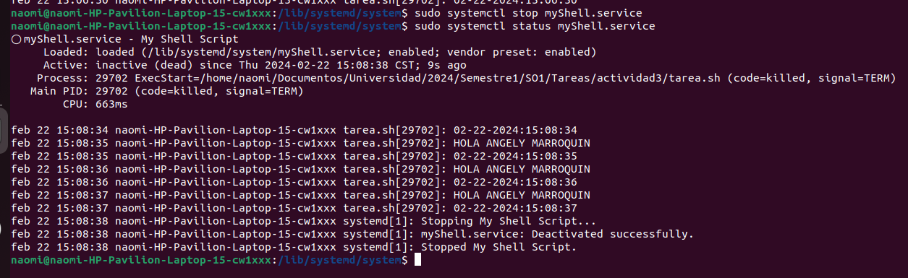

- ** Paso 1: Crear un script y otorgale permisos de ejecucion **
  
    - sudo nano /usr/bin/myScript.sh

        ``` 
        #! /bin/bash
        echo "HOLA MUNDO"
        # otras lineas de codigo ...
        ``` 
    
    - sudo chmod  +x /usr/bin/myScript.sh

- ** Paso 2: Crear un archivo System unit **
    - sudo nano /lib/systemd/system/myShell.service 
        Es muy importante que el archivo tenga extension ".service"
    
        ``` 
        [Unit]
        Description=My Shell Script

        [Service]
        ExecStart=/usr/bin/myScript.sh

        [Install]
        WantedBy=multi-user.target
        ``` 
- **Paso 3: Habilitar el Servicio **
    Se debe recargar el demonio del sistema cada vez que se realice un cambio en el archivo ".service"
    - sudo systemctl daemon-reload 
    
    Se habilita el servicio
    - sudo systemctl enable myShell.service 

    Se inicia el servicio
    - sudo systemctl start myShell.service 

    Para verificar los logs del servicio
    - sudo systemctl status myShell.service 

    

    Para parar el servicio
    - sudo systemctl stop myShell.service

    


