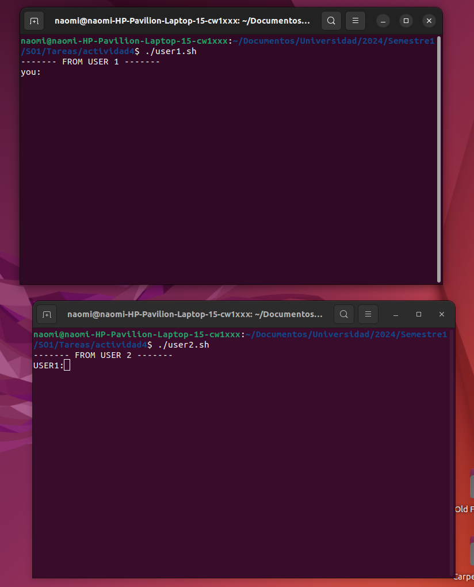
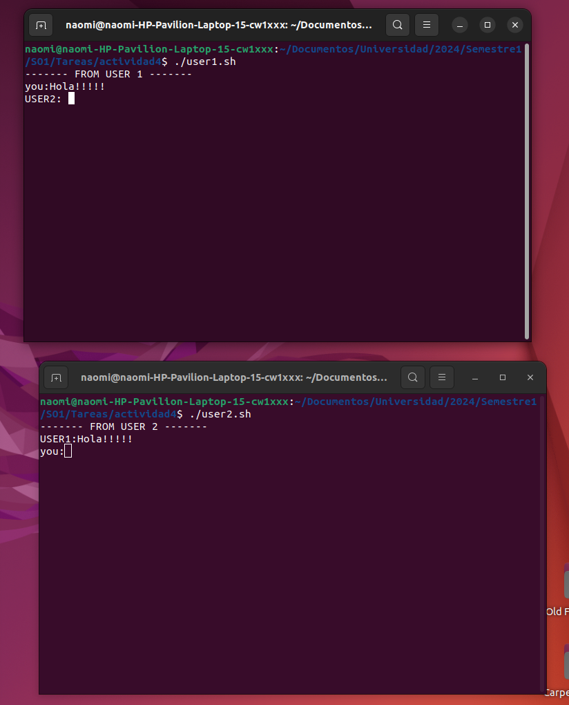
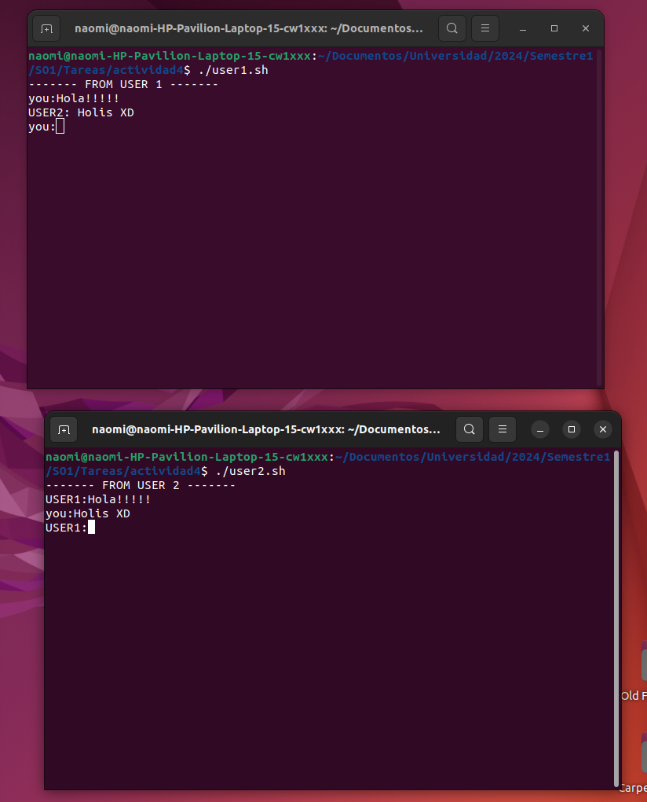

- **Paso 1:** Ejecutar ambos scripts

- **Paso 2:** Ingresar texto en "./user1.sh"
Despues de presionar Enter, automaticamente aparece el mensaje en la console de "./user2.sh"

- **Paso 3:** Ingresar texto en "./user2.sh"
Ahora el usuario 2 puede responder a user1 ingresando el mensaje en consola y posteriormente presionando enter

**NOTA** Si el pipe NO EXISTE, el script lo crea
