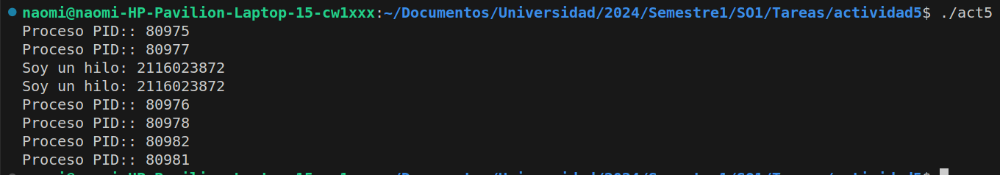

### Hilos y Procesos

- codigo: 

```
#include <unistd.h>
#include <stdio.h>
#include <pthread.h>

void *isThread(){
    int id;
    id = pthread_self();
    printf("Soy un hilo: %d\n", id);
    
}

void thread_create() {
    pthread_t hilo;
    
    pthread_create(&hilo, NULL, isThread, NULL);
    
    pthread_join(hilo,NULL);
}

int main() {
    pid_t pid;
    pid = fork();

    if (pid==0) {
        /* child proccess*/
        fork();
        thread_create();
    }
    fork();

    printf("Proceso PID:: %d\n", getpid()); 
    return 0;
}

```



a. ¿Cuántos procesos únicos son creados? 6 Procesos

b. ¿Cuántos hilos únicos son creados? 2 Hilos